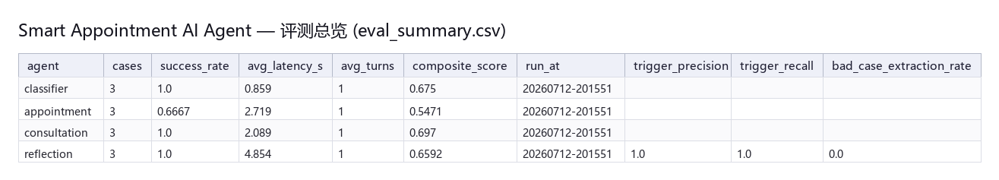
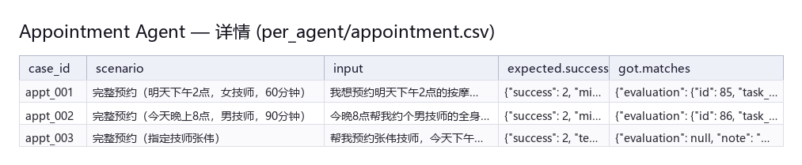
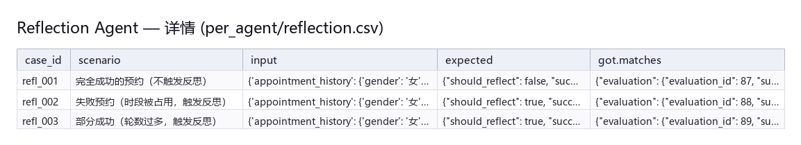

# Smart Appointment AI Agent

智能预约 AI Agent 是一个面向服务行业（按摩/足疗门店）的多 Agent 协作对话系统，基于 FastAPI、LangChain、FAISS 和 SQLite 构建。系统能够自动识别用户意图（咨询/预约/其他），通过多 Agent 分工完成知识问答、技师智能匹配、预约管理和用户行为分析。

> 本项目用于个人 AI/Agent 技术学习与实践展示。

---

## 核心能力

| 能力 | 实现方案 |
|------|----------|
| **智能任务分类** | LLM + 结构化输出，判断用户意图并路由到对应 Agent |
| **多 Agent 协作** | TaskClassification → Appointment / Consultation / UserBehavior 分流 |
| **RAG 知识问答** | FAISS 向量索引 + LangChain Embedding，支持流式输出 |
| **预约双重预约防护** | DB 事务级原子检查+插入，彻底消除并发竞态 |
| **技师智能匹配** | 按专长相似度 + 性别偏好 + 时间可用性多维排序 |
| **用户行为分析** | 偏好提取、模式识别、个性化回访提醒 |
| **会话记忆系统** | 三层记忆（工作/语义/摘要）+ 自动压缩 |
| **流式响应** | FastAPI AsyncGenerator，后端边生成边推送 |
| **反思与学习系统** | 任务评估、失败根因分析、周期性报告、策略优化 |
| **反思闭环 A/B 评测** | L3 评测框架 + 根因分析报告生成器，量化反思引擎是否真正改善主链路 |
| **增强型咨询记录** | RAG 评估闭环，记录文档分数/回答内容/用户关联 |

---

## 系统架构

```
Web Layer          (FastAPI + Jinja2 模板)
     ↓
API Layer          (请求编排、响应封装)
     ↓
Agents Layer       (TaskClassification / Appointment / Consultation / UserBehavior / Reflection)
     ↓
Services Layer     (业务逻辑、Embedding、推荐算法)
     ↓
DB Layer           (SQLite WAL + SQLAlchemy + Repository 模式)
```

### 分层原则
- **上层调用下层**：Web → API → Agents → Services → DB，禁止反向
- **Repository 模式**：数据访问层统一封装，事务边界清晰
- **单一写锁**：所有写操作通过 `threading.RLock` + SQLite WAL 模式并发保护

---

## 技术栈

| 层级 | 技术选型 |
|------|----------|
| 后端框架 | FastAPI + Uvicorn |
| AI 框架 | LangChain |
| 大模型 | OpenAI 兼容格式（Qwen / DeepSeek / Zhipu / Azure OpenAI） |
| 向量检索 | FAISS |
| 数据库 | SQLite (WAL 模式) + SQLAlchemy |
| 前端 | Jinja2 HTML 模板 + 响应式 CSS |
| 外部扩展 | MCP (天气信息等) |

---

## 项目结构

```
smart-appointment-ai-agent/
├── agents/                          # 多 Agent 核心
│   ├── task_classification_agent.py # 任务分类 & 主路由
│   ├── appointment_agent.py         # 预约流程控制
│   ├── consultant_agent.py          # RAG 咨询 Agent
│   ├── user_behavior_agent.py       # 行为分析 Agent
│   ├── reflection_agent.py          # 反思与学习 Agent
│   ├── task_classification/         # 意图识别、状态管理
│   ├── appointment/                # 解析器、技师匹配器、数据库操作器
│   ├── consultant/                  # 提示词构建、回答生成
│   ├── user_behavior/              # 模式分析、偏好管理
│   └── reflection/                 # 评估器、分析器、报告生成器、闭环组件
│       ├── evaluator.py           # 任务评估器
│       ├── analyzer.py            # 反思分析器
│       ├── reporter.py            # 报告生成器
│       ├── engine.py              # 反思引擎
│       ├── reflection_aware.py   # 反思感知混入类（闭环）
│       ├── strategy_updater.py    # 策略更新器（闭环）
│       ├── closed_loop_evaluator.py # 闭环效果验证器（闭环）
│       └── context_provider.py    # 反思上下文提供者（闭环）
├── api/                             # API 编排层
│   ├── chat_handler.py              # 流式聊天处理核心
│   ├── knowledge.py                 # 知识库 CRUD + 搜索
│   ├── technician.py               # 技师管理接口
│   ├── user_behavior_analysis.py    # 行为分析接口
│   └── reflection_api.py           # 反思接口
├── services/                        # 业务逻辑层
│   ├── knowledge_service.py         # FAISS 索引 + 知识检索
│   ├── appointment_service.py       # 预约业务（原子性预约）
│   ├── text_embedding.py           # Embedding 生成与缓存
│   ├── conversation_memory_service.py  # 工作记忆 + 自动压缩
│   ├── semantic_memory_service.py    # 偏好提取 + 置信度管理
│   └── memory_manager.py            # 记忆系统统一调度
├── db/                              # 数据持久化层
│   ├── base/
│   │   ├── session_manager.py      # SQLite WAL + 写锁管理
│   │   ├── interfaces.py           # Repository 抽象接口
│   │   └── exceptions.py           # 自定义异常
│   ├── repositories/               # Repository 实现
│   │   ├── technician_repository.py
│   │   ├── knowledge_repository.py
│   │   ├── user_behavior_repository.py
│   │   ├── memory_repository.py
│   │   └── reflection_repository.py
│   ├── models.py                   # SQLAlchemy 数据模型
│   └── models_memory.py            # 记忆系统数据模型
├── eval/                            # 离线评测体系
│   ├── runners/
│   │   ├── base.py                  # EvalCase / EvalResult / 计时工具
│   │   ├── classifier_runner.py
│   │   ├── appointment_runner.py
│   │   ├── consultation_runner.py
│   │   ├── reflection_runner.py
│   │   ├── reflection_ab_runner.py  # L3 反思闭环 A/B 评测
│   │   └── root_cause_report.py     # 反思链路根因分析报告
│   ├── datasets/                    # 测试用例集（JSON）
│   ├── render_csv_screenshot.py     # 评测报告截图渲染
│   └── README.md
├── reports/                         # 评测产物（含历史时间戳目录）
├── scripts/                         # 工具脚本
│   └── create_reflection_tables.py # 反思模块数据库初始化
├── examples/                        # 示例代码
│   └── reflection_demo.py         # 反思 Agent 使用示例
├── tests/                          # 测试代码
│   ├── test_reflection_closed_loop.py  # 闭环组件单元测试
│   ├── test_task_evaluator.py         # 任务评估逻辑测试
│   ├── test_strategy_updater.py        # 策略生成测试
│   ├── test_closed_loop_evaluator.py  # 闭环效果计算测试
│   ├── test_error_classification.py    # 错误分类测试
│   ├── test_reflection_integration.py  # 端到端集成测试
│   ├── test_effectiveness.py           # 效果验证测试
│   └── conftest.py                    # Pytest 配置
├── web/
│   ├── routes.py                  # 页面路由
│   └── templates/                  # HTML 模板
├── app.py                          # 应用入口
└── requirements.txt
```

---

## 关键设计

### 1. 多 Agent 协作与任务路由

```
用户消息 → TaskClassificationAgent
    ├── 咨询类 → ConsultantAgent（RAG 知识检索 + 流式回答）
    ├── 预约类 → AppointmentAgent（提取需求 → 技师匹配 → 预约确认）
    └── 其他类 → 友好拒绝或转接
```

LLM 通过结构化输出（JSON Mode）判断意图，避免纯规则匹配的脆弱性。

### 2. RAG 知识问答

```
查询 → Embedding → FAISS Top-K 检索 → 上下文构建 → LLM 生成 → 流式响应
```

FAISS 索引在服务启动时构建，知识增删改后自动重建，支持按分类过滤。

### 3. 并发安全 — 原子性预约

传统预约的 Check-Then-Act 竞态：

```
请求A: is_available() → True
请求B: is_available() → True  ← 同时通过
请求A: add_schedule() → 成功
请求B: add_schedule() → 冲突！
```

本项目通过 `reserve_slot()` 在单个 DB 事务 + 写锁内完成检查与插入，彻底消除竞态：

```python
def reserve_slot(self, technician_id, start_time, end_time, status, appointment_id):
    with self.session_scope(exclusive=True):   # 持有写锁
        conflict = query_conflict()            # 冲突检测
        if conflict:
            raise SlotTakenException()         # 原子拒绝
        insert_schedule()                      # 插入记录
```

### 4. 三层会话记忆系统

```
ConversationMemoryService  工作记忆   当前会话消息
SemanticMemoryService     语义记忆   用户偏好提取
SessionSummary            摘要压缩   超过阈值时压缩历史
```

超过 20 轮对话后触发 LLM 摘要压缩，控制 token 消耗同时保留关键上下文。

### 5. 技师智能匹配

```
用户偏好 → 文本嵌入相似度排序 → 性别筛选 → 可用性检查 → 推荐
```

支持按专长相似度匹配指定技师、按偏好智能推荐、按性别筛选等多个维度。

### 6. 反思与学习系统（闭环）

```
任务完成 → 评估器 → 分析器 → 报告器 → 洞察
              ↓                              ↓
          反思触发条件                  策略更新器
          - 成功率 < 70%                ↓
          - 对话轮数 > 10               策略激活
          - 完成时间 > 120秒             ↓
          - 任务失败                 闭环验证器
                                      ↓
                               Agent 应用洞察（闭环）
```

反思 Agent 提供完整的学习闭环：

| 组件 | 功能 |
|------|------|
| **TaskEvaluator** | 评估成功率、对话轮数、完成时间、错误分类 |
| **ReflectionAnalyzer** | 分析失败根因、发现用户模式、识别坏 case |
| **ReflectionReporter** | 生成周期性报告、用户洞察、仪表盘数据 |
| **ReflectionEngine** | 协调评估-分析-报告流程，提供统一接口 |

#### 闭环组件

| 组件 | 功能 |
|------|------|
| **ReflectionAwareMixin** | 反思感知混入类，让 Agent 可访问和应用洞察 |
| **StrategyUpdater** | 策略更新器，基于洞察动态调整 Agent 策略 |
| **ClosedLoopEvaluator** | 闭环效果验证器，验证策略改进效果 |
| **ReflectionContextProvider** | 反思上下文提供者，为 Agent 提供结构化上下文 |

#### 闭环流程

```
┌─────────────────────────────────────────────────────────────────┐
│                     反思闭环系统                                   │
├─────────────────────────────────────────────────────────────────┤
│                                                                  │
│   评估 → 分析 → 生成洞察 → 策略更新 → 策略激活                     │
│                                    ↓                             │
│                              闭环验证器                            │
│                                    ↓                             │
│                        Agent 应用洞察（预约/咨询）                  │
│                                    ↓                             │
│                              新一轮评估                           │
│                                                                  │
└─────────────────────────────────────────────────────────────────┘
```

支持任务后反思、周期性反思、阈值触发反思、手动触发反思四种模式。

### 7. 增强型咨询记录与 RAG 评估闭环

为了支持 RAG 系统的持续优化，系统记录了丰富的咨询行为数据：

```python
action_data = {
    'question': '你们的营业时间是几点到几点？',
    'knowledge_docs_used': 3,
    'doc_scores': [0.923, 0.856, 0.812],  # 每条文档的相似度分数
    'doc_ids': [1, 5, 8],                  # 文档ID列表
    'max_score': 0.923,                     # 最高分
    'avg_score': 0.864,                     # 平均分
    'categories': ['服务信息', '门店信息'],  # 文档分类
    'user_id': 'user123',                   # 用户ID
    'response_content': '我们的营业时间是...',  # 回答内容
    'response_length': 128,                  # 回答长度
    'timestamp': '2026-06-30 20:30:00'
}
```

#### 可用于分析的维度

| 分析维度 | 数据字段 | 说明 |
|---------|---------|------|
| RAG 质量分析 | `doc_scores`, `max_score` | 分析"高分但答错"的情况 |
| 用户行为分析 | `user_id`, `session_id` | 用户级别的行为追踪 |
| 生成质量评估 | `response_content`, `response_length` | 端到端回答质量评估 |
| 检索效果分析 | `doc_ids`, `categories` | 分析哪些文档被命中 |

#### 查询接口

```python
# 获取高分但可能低质量的案例（用于分析 RAG 问题）
service.get_high_score_low_quality_consultations(score_threshold=0.8)

# 获取咨询统计信息
service.get_consultation_statistics(days_back=30)

# 获取用户咨询历史
service.get_user_consultation_history(user_id='user123')
```

---

## 快速启动

### 1. 环境配置

```bash
# 克隆项目
git clone https://github.com/lizhengyangasasds/smart-appointment-ai-agent.git
cd smart-appointment-ai-agent

# 创建虚拟环境
python -m venv .venv
# Windows
.venv\Scripts\activate
# Linux/macOS
source .venv/bin/activate

# 安装依赖
pip install -r requirements.txt

# 配置环境变量
cp .env.example .env
# 编辑 .env 填入 API Key 和模型配置
```

### 2. 初始化数据库

```bash
# 初始化基础数据库
python scripts/init_db.py

# 初始化反思模块数据库表（如需使用反思功能）
python scripts/create_reflection_tables.py create
```

### 3. 启动服务

```bash
python -m uvicorn app:app --host 127.0.0.1 --port 8000 --reload
```

启动后访问：
- Web 聊天界面：http://127.0.0.1:8000
- 知识库管理：http://127.0.0.1:8000/knowledge
- 技师排班：http://127.0.0.1:8000/technician_schedule
- 用户行为分析：http://127.0.0.1:8000/user_behavior

---

## 数据模型

### 业务数据表

| 表名 | 说明 |
|------|------|
| `technicians` | 技师信息（姓名、性别、专长） |
| `technician_schedules` | 排班记录（技师、时间段、状态、预约ID） |
| `knowledge_documents` | 知识库（内容、分类、关键词、向量嵌入） |
| `user_behaviors` | 用户行为日志（预约/咨询类型、操作数据） |
| `user_preferences` | 用户偏好（类型、值、置信度） |
| `user_recommendations` | 用户推荐记录（推荐内容、发送状态） |

### 会话记忆表

| 表名 | 说明 |
|------|------|
| `conversation_messages` | 会话消息（角色、内容、轮次、压缩标记） |
| `semantic_memories` | 语义记忆（类型、Key-Value、置信度） |
| `session_summaries` | 会话摘要（压缩后的上下文） |

### 反思学习表

| 表名 | 说明 |
|------|------|
| `task_evaluations` | 任务评估（成功率、轮数、耗时、错误类型） |
| `reflection_logs` | 反思日志（发现、建议、模式、坏 case） |
| `user_feedbacks` | 用户反馈（评分、类型、内容、来源） |

---

## 📊 离线评测体系

### 一、跑一次

```bash
# 跑全部 4 个 Agent 共 30 条 case（默认 ~15 分钟）
python -m eval.run_eval

# 限制每个 Agent 的 case 数（debug 用，推荐 2~3 条）
python -m eval.run_eval --limit 3

# 只跑某一个 Agent
python -m eval.run_eval --agent reflection
```

跑完会在 `reports/<时间戳>/` 下生成三类产物：

```
reports/<run_at>/
├── eval_summary.csv          ← 一行一个 Agent 的总览
├── latest_run.json           ← 全量快照（summary + 每条 case 详情）
└── per_agent/
    ├── classifier.csv        ← 每条 case 的 expected / got / 成功 / 延迟 / 错误
    ├── appointment.csv
    ├── consultation.csv
    └── reflection.csv
```

### 二、评测报告截图

> 以下截图来自 `reports/20260712-201551/`（4 Agent × 3 case = 12 条，~40 秒跑完）。

**总览（`eval_summary.csv`）：**



**Appointment 详情：**



**Reflection 详情（含反思触发判定）：**



### 三、指标定义

| 指标 | 公式 / 来源 |
|---|---|
| `success_rate` | `case.success == 1` 的占比 |
| `avg_latency_s` | `time.monotonic()` 测的 wall time（含失败） |
| `composite_score` | `0.4 × success_rate + 0.3 × (1 − latency_norm) + 0.3 × (1 − turns_norm)` |
| `trigger_precision` | `should_reflect=True` 中确实写 `reflection_logs` 的占比 |
| `trigger_recall` | 期望反思的 case 中实际触发的占比 |
| `bad_case_extraction_rate` | `reflection_logs.bad_cases` 非空的占比 |

> 成功条件不重新实现 —— 直接复用项目里的 `TaskEvaluator.evaluate_appointment_task` 落库结果 + `ReflectionAwareMixin` 的 `should_reflect` 判定，避免"评测库与业务库双口径分裂"。

### 四、本次跑出来的 4 个发现

1. **classifier 100% 命中** —— 任务分类在 3 个测试意图下都正确分流（appointment / query / 其他）。
2. **reflection 100% 触发正确** —— 1 条 SUCCESS 不反思、2 条 FAILED/超时 触发反思，`trigger_precision = trigger_recall = 1.0`。
3. **consultation 100% 命中类别** —— RAG 检索返回的 categories 都覆盖期望类别（`top_category ∈ categories`）。
4. **appointment success_rate = 66.7%** —— 完整信息（女/男 + 时间 + 项目 + 时长）下 2 条都正确识别并落库；剩 1 条（`appt_003` 指定"张伟技师"）因 LLM JSON 输出异常未生成 evaluation 行。

### 五、评测暴露的真实 bug（已修）

第一次跑出来时 appointment success_rate = 0%，**真正有用的不是数字本身，而是 traceback**。DB 现场：

```
session_id: eval-appointment-appt_001-1783853111159
success: 0 / rate: 0.0 / err_type: low_completion
action_data: {gender: None, start_time: None, duration: None, project: None, ...}
```

`action_data` 全是 None 但用户明明说"明天下午2点，女技师，60分钟"——说明 evaluator 收到的 `appointment_history` 在传入时就是空 dict。

**根因（`agents/appointment_agent.py:436-440`）**：完成预约时先 `_reset_state_after_appointment()` 再 `_record_eval()`。`reset()` 会清空 `appointment_history`，evaluator 看到的就是空 dict，触发 `low_completion`。

**修复**：交换两个分支的顺序。先 `_record_eval(eval_reason)`，再 `reset()`。附回归测试 `tests/test_appointment_agent.py::TestEvaluationOrderingBug`，2 个 case。

**Runner 自身 bug（已修）**：`eval/runners/appointment_runner.py:_fetch_latest_evaluation` 没把 `action_data` 一起 select，导致 `min_gender` 兜底匹配恒为 False。补上行后 appointment success_rate 提升到 66.7%。

### 六、再生成截图

如果更新了 CSV 想重新渲染 README 截图：

```bash
# 一次性安装 Pillow
.\.venv\Scripts\pip.exe install pillow

# 修改 eval/render_csv_screenshot.py 顶部的 REPORTS_DIR / 各 render_*() 函数
# 把硬编码的目录改成新的时间戳，然后重跑：
python eval/render_csv_screenshot.py
# 输出：reports/screenshots/{eval_summary,appointment_detail,reflection_detail}.png
```

### 七、Eval 框架关键约束

- **不重写 Agent** —— runner 只调现有入口（`AppointmentAgent.run_stream` / `ConsultantAgent.consult_stream` / `TaskClassifier.classify_task` / `ReflectionAgent.reflect_on_appointment`）
- **不复用业务 DB 主会话** —— 每个 case 用独立 `session_id = f"eval-{agent}-{case_id}-{ts}"` 隔离
- **失败兜底**：case 异常 → `EvalResult(success=0, error=<traceback>)`，**不吞异常**，失败本身就是评测对象
- **不调 LLM-as-Judge** —— 避免评测成本翻倍
- **不开新表** —— 复用 `task_evaluations` 作为事实源

详细指标 / 成功条件 / 反射子指标，参见 [`eval/README.md`](eval/README.md)。

---

## 🧪 L3 反思闭环 A/B 评测与根因分析

在基础评测体系之上，2026-07 新增了 **L3 层级的反思闭环 A/B 评测**——目的是验证"Agent 真的用上了反思"而不是"反思在跑但没人理它"。

### 一、反思闭环 A/B Runner

```bash
# 跑 3 个 appointment case × 2 variants = 6 次
python -m eval.runners.reflection_ab_runner

# 冒烟（1 case × 2）
python -m eval.runners.reflection_ab_runner --cases ab_happy
```

**A/B 变量**：同一个 case 跑两次 AppointmentAgent——
- **A（treatment）**：`AppointmentAgent(reflection_engine=engine)`，prompt 注入真实洞察
- **B（control）**：`AppointmentAgent(reflection_engine=None)`，`get_insights()` 返回默认空 dict

**核心指标**：`success_rate_a - success_rate_b` / `avg_turns_a - avg_turns_b` / `composite_score_a - composite_score_b`。

### 二、反射链路可观测性报告

```bash
python -m eval.runners.root_cause_report
# 产物：reports/l3_root_cause_<时间戳>/FINDINGS.md
```

一次性输出 4 类数据：
1. **reflection_logs 全表统计**（最近 50 条：bad_cases / recommendations / patterns 提取率）
2. **嵌套 JSON vs 外层列字段对比**（关键：诊断"数据在哪丢"）
3. **strategy_versions 闭环状态**（按 strategy_type / status 分组）
4. **L3 A/B 上一次跑的 Δ**

### 三、当前发现（2026-07-12 实测）

| 字段 | 嵌套在 `findings` JSON 里（真实路径） | 外层列字段（写库路径） |
|---|---|---|
| bad_cases | 0/47（0.0%） | 0/47（0.0%） |
| recommendations | 25/47（53.2%） | 2/47（4.3%） |
| patterns | 25/47（53.2%） | 0/47（0.0%） |

> **关键结论**：LLM 实际把 recommendations / patterns 都提取出来了，但 `agents/reflection/engine.py:214-219` 字段名错配（`typical_cases` / `insights` 不存在）导致外层列全空——**激活的策略没有"依据"**。修复 10 行代码后，外层 recommendations 应能从 4.3% 提升到 53.2%，patterns 从 0% 提升到 53.2%。

### 四、L3 A/B 当前实测数字

```
n_cases=3 × 2 variants = 6 次跑
  success_rate   (A / B): 0.333 / 0.333   Δ=0.000
  full_success   (A / B): 0.333 / 0.333   Δ=0.000
  avg_turns      (A / B): 0.0 / 0.0       Δ=0.000
  avg_latency    (A / B): 1.99s / 1.985s
  composite      (A / B): 0.513 / 0.513   Δ=0.000
```

**Δ=0 不是反思没用**，而是 (1) DB 状态污染、(2) 字段名 bug 拦截了洞察、(3) happy case 占比太高、(4) 样本量仅 3。修复字段名 bug + 重置 DB + 加 failure case 后 Δ 应能反映真实差异。

详细产物与原始统计：参见 `reports/l3_root_cause_<时间戳>/FINDINGS.md` 与 `reports/l3_ab_full/ab_summary.json`。

